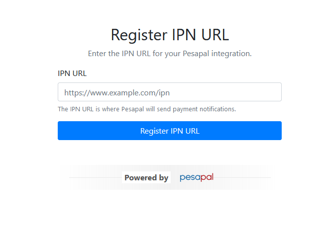
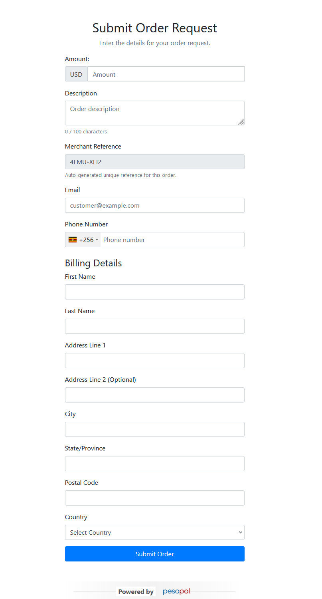
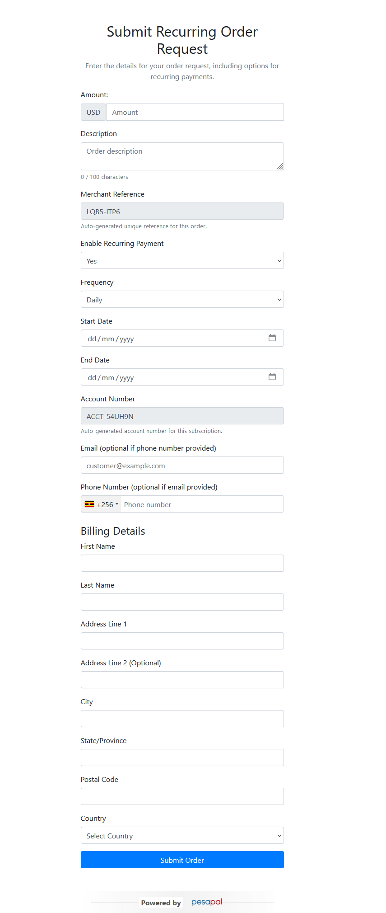
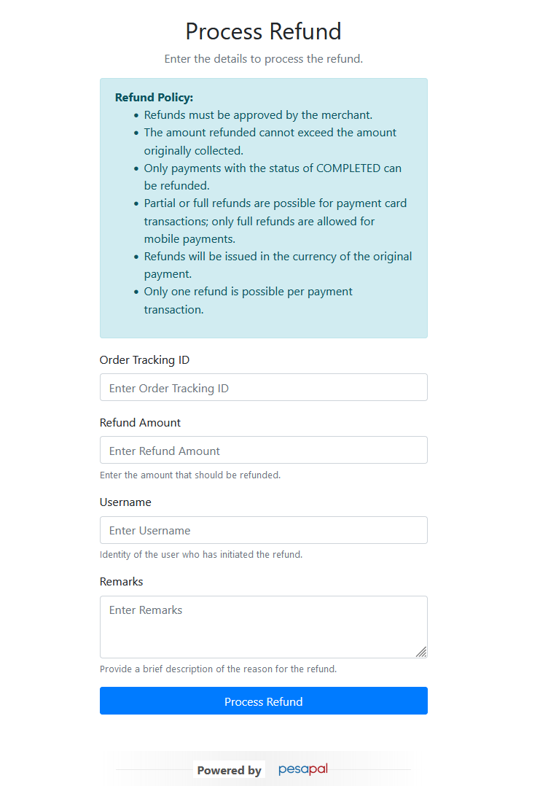
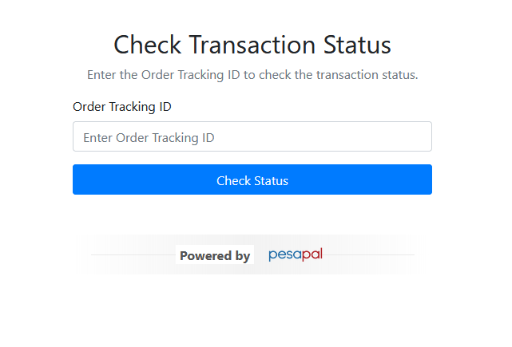

# Pesapal PHP SDK

[](LICENSE)

The **Pesapal PHP SDK** provides a simple and efficient way to integrate the Pesapal Payment Gateway into your PHP application. This SDK handles authentication, order submission, transaction status checks, recurring payments, and refunds, making it easier for developers to interact with Pesapal's API 3.0.

## Table of Contents

- [Pesapal PHP SDK](#pesapal-php-sdk)
  - [Table of Contents](#table-of-contents)
  - [Features](#features)
  - [Requirements](#requirements)
  - [Installation](#installation)
  - [Configuration](#configuration)
  - [Usage](#usage)
    - [Authentication](#authentication)
    - [Important Notice: IPN Registration](#important-notice-ipn-registration)
    - [Register IPN URL](#register-ipn-url)
    - [Submit Order](#submit-order)
    - [Get Transaction Status](#get-transaction-status)
    - [Recurring Payments](#recurring-payments)
    - [Refund Request](#refund-request)
    - [Get Transaction Status](#get-transaction-status-1)
    - [Tutorials and Guides](#tutorials-and-guides)
    - [Testing Environment Setup](#testing-environment-setup)
  - [License](#license)

## Features

- **Authentication**: Obtain and manage access tokens using your Pesapal `consumer_key` and `consumer_secret`.
- **IPN Registration**: Register Instant Payment Notification (IPN) URLs to receive real-time transaction status updates.
- **Order Submission**: Create and submit payment requests to Pesapal.
- **Transaction Status**: Check the status of transactions using the `OrderTrackingId`.
- **Recurring Payments**: Set up and manage subscription-based payments.
- **Refunds**: Request refunds for completed transactions.

## Requirements

- PHP 8.0 or higher
- Composer
- cURL extension enabled
- An active Pesapal merchant account with `consumer_key` and `consumer_secret`
- A **sandbox keys file** for testing, provided in the project as `pesapal_sandbox_keys.json`. This file contains test keys for different merchant regions (e.g., Kenya, Uganda, Tanzania). You can find the file in the root directory of the project.

## Installation

Use Composer to install the Pesapal PHP SDK:

```bash
composer require katorymnd/pesapal-php-sdk
```

## Configuration

1. **Clone the Repository (if not using Composer):**

   ```bash
   git clone https://github.com/katorymnd/pesapal-php-sdk.git
   ```

2. **Install Dependencies:**

   Navigate to the project directory and install dependencies:

   ```bash
   cd pesapal-php-sdk
   composer install
   ```

3. **Set Up Environment Variables:**

   - Copy the `.env.example` file to `.env`:

     ```bash
     cp .env.example .env
     ```

   - Open the `.env` file and set your Pesapal `consumer_key` and `consumer_secret`:

     ```env
     CONSUMER_KEY=your_consumer_key_here
     CONSUMER_SECRET=your_consumer_secret_here
     ```

4. **Ensure `pesapal_dynamic.json` is Writable:**

   The SDK uses `pesapal_dynamic.json` to store the `access_token` and other dynamic data. Make sure this file is writable by your application.

## Usage

### Authentication

The SDK automatically handles authentication with Pesapal. Upon initialization, the SDK retrieves the `access_token` using your configured `consumer_key` and `consumer_secret`. The token is valid for 5 minutes and is securely stored in `pesapal_dynamic.json`.

You don't need to manually request or manage the `access_token`; the SDK ensures it is always available and refreshed as needed for API calls.

---

**How it Works:**

1. When you make an API call, the SDK checks for a valid `access_token` in `pesapal_dynamic.json`.
2. If the token is expired or unavailable, the SDK automatically re-authenticates with Pesapal and updates `pesapal_dynamic.json`.

### Important Notice: IPN Registration

Before initiating any transactions, it is mandatory to register an IPN (Instant Payment Notification) URL. This allows your application to receive **real-time updates** on payment status, such as successful payments, failures, or reversals.

But here's where this SDK shines: it **automatically handles IPN registration smartly based on your environment** (sandbox or production) — making it easier to avoid common mistakes.

---

#### 🔍 How IPN Registration Works Behind the Scenes

When the SDK initializes (e.g., via `submit_order.php` or `register_ipn.php`), it follows this logic:

1. **Reads `pesapal_dynamic.json`** to load your previously registered IPN URL and `notification_id`.
2. **Checks if the current environment (`sandbox` or `production`) matches** the `token_env` (also saved in `pesapal_dynamic.json`).
3. If the environment has **changed**, or if the **IPN URL does not match** what Pesapal has on record, it:

   - Automatically registers the correct IPN URL with Pesapal for the active environment using the already available IPN URL in your `pesapal_dynamic.json`.

   ```json
   "ipn_url": "https://www.example.com/ipn",

   ```

   - Updates the file `pesapal_dynamic.json` with the new `notification_id`, `access_token`, and environment tag (`token_env`).

4. You **don’t need to manually update** this again – it’s handled for you.

---

#### 🛠️ Configure for Sandbox or Production

At the top of each example (e.g., `register_ipn.php`, `submit_order.php`), you’ll find this block:

```php
$environment = 'sandbox';    // Change to 'production' when going live
$sslVerify   = false;        // Set to true in production
```

Switch to production like this:

```php
$environment = 'production';
$sslVerify   = true;
```

---

#### ✅ What You Need to Do

- **Set your environment** (`sandbox` or `production`)
- **Ensure your `.env` file has the correct keys**
- Let the SDK handle the rest: it will verify and register your IPN URL automatically.

---

**Why This Matters:**

Pesapal assigns different notification IDs depending on the environment. If you use a sandbox `notification_id` in production (or vice versa), your payment callbacks may fail. This SDK prevents that error for you.

---

### Register IPN URL

Refer to:
`example/register_ipn.php`

This script demonstrates how to register an IPN URL and retrieve the `notification_id` required for all transactions.



### Submit Order



- **File Location:** `example/submit_order.php`

See usage section for code sample…

### Get Transaction Status

```php
$orderTrackingId = $_GET['OrderTrackingId'];
$status = $pesapal->getTransactionStatus($orderTrackingId);
echo 'Transaction Status: ' . $status['status'];
```

### Recurring Payments



- **File Location:** `example/recurring_order.php`

See usage section for code sample…

### Refund Request



- **File Location:** `example/RefundTransactionHandler.php`

See usage section for code sample…

### Get Transaction Status



- **File Location:** `example/transaction_helpers.php`

See usage section for code sample…

### Tutorials and Guides

Embark on your journey with the Pesapal PHP SDK through our exclusive tutorials and guides:

- **[Installing Pesapal SDK: Kickstart Your Payment Integration](https://katorymnd.com/article/installing-pesapal-sdk-kickstart-your-payment-integration)**
- **[Mastering Pesapal SDK: Unlock Advanced Payment Features](https://katorymnd.com/article/mastering-pesapal-sdk-unlock-advanced-payment-features)**

### Testing Environment Setup

For testing and development purposes, utilize the test cards provided by Pesapal at the following URL:

[https://cybqa.pesapal.com/PesapalIframe/PesapalIframe3/TestPayments](https://cybqa.pesapal.com/PesapalIframe/PesapalIframe3/TestPayments)

## License

This project is licensed under the MIT License - see the [LICENSE](LICENSE) file for details.

---

_Disclaimer: This SDK is not an official Pesapal product. It's an independent project aimed at simplifying Pesapal API integration for PHP developers. For any issues related to the Pesapal API itself, please contact [Pesapal Support](https://www.pesapal.com/support)._
